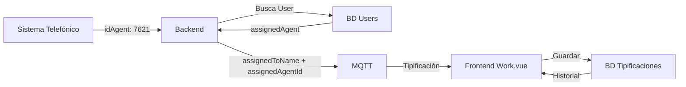

# 📋 Historial de Tipificaciones: Información del Agente

## 📋 Descripción

Se agregó la visualización del agente que atendió cada llamada en el historial de tipificaciones completadas, mostrando tanto el nombre del agente como su ID del sistema telefónico.

## 🎯 Visualización

### **En el Historial Completado:**

```
📋 Historial Completado

1.
ID: 572170
: 1010480297
Completada

👤 Agente: maría (ID: 7621)        ← NUEVO
Observación: dasdasdas
Niveles: ...
Fecha: 29/09/2025, 08:23 p. m.
```

## 🔧 Implementación Técnica

### **1. Backend: Agregar assignedAgentId**

En `routes/index.routes.js` (línea 630):

```javascript
const tipificacionData = {
  // ... campos existentes
  assignedTo: userIdPlano,           // ObjectId del usuario
  assignedToName: assignedAgent.name || 'Usuario',  // "maría"
  assignedAgentId: assignedAgent.idAgent || '',     // "7621" ← NUEVO
  // ...
};
```

### **2. Modelo: Agregar Campo**

En `models/tipificacion.js` (línea 12):

```javascript
const tipificacionSchema = new mongoose.Schema({
  // ... campos existentes
  assignedTo: { type: String },
  assignedToName: { type: String },
  assignedAgentId: { type: String }, // ← NUEVO: ID del agente del sistema telefónico
  // ...
});
```

### **3. Frontend: Visualización**

En `Work.vue` (líneas 397-401):

```vue
<div class="history-details">
  <p class="text-dark" v-if="item.assignedToName">
    <strong class="text-dark">👤 Agente:</strong> 
    {{ item.assignedToName }}
    <span v-if="item.assignedAgentId" class="badge-agent-id">
      (ID: {{ item.assignedAgentId }})
    </span>
  </p>
  <!-- ... otros detalles -->
</div>
```

### **4. Estilo del Badge**

En `Work.vue` (líneas 1536-1544):

```css
.badge-agent-id {
  background: #6c757d;  /* Gris */
  color: #fff;
  border-radius: 4px;
  padding: 2px 8px;
  font-size: 0.85em;
  margin-left: 4px;
  font-weight: 600;
}
```

## 📊 Datos Disponibles

### **De la Colección `users`:**

```javascript
{
  "_id": "68bca1539dc890d81c974d68",
  "name": "maría",           // ← assignedToName
  "idAgent": "7621",         // ← assignedAgentId (NUEVO)
  "correo": "asesor@ministerio.edu",
  "role": "..."
}
```

### **En la Tipificación:**

```javascript
{
  "_id": "...",
  "idLlamada": "572170",
  "cedula": "1010480297",
  "assignedTo": "68bca1539dc890d81c974d68",     // ObjectId
  "assignedToName": "maría",                    // Nombre
  "assignedAgentId": "7621",                    // ID telefónico ← NUEVO
  "status": "success",
  "observacion": "..."
}
```

## 🔄 Flujo de Datos



## ⚠️ Nota Importante

### **Tipificaciones Antiguas:**

Las tipificaciones guardadas **antes** de este cambio **NO tendrán** el campo `assignedAgentId`, solo mostrarán:

```
👤 Agente: maría
```

Las tipificaciones **nuevas** (a partir de ahora) mostrarán:

```
👤 Agente: maría (ID: 7621)
```

## 🧪 Pruebas

### **Verificar en Consola del Navegador:**

Cuando se recibe una nueva tipificación:

```javascript
console.log('👤 Agente asignado:', data.assignedToName, '- ID:', data.assignedAgentId);
// Debería mostrar: 👤 Agente asignado: maría - ID: 7621
```

### **Verificar en Base de Datos:**

```javascript
db.tipificaciones.findOne({ idLlamada: "572170" })
```

Debería incluir:
```json
{
  "assignedToName": "maría",
  "assignedAgentId": "7621"
}
```

## 📁 Archivos Modificados

- `routes/index.routes.js` - Agregar assignedAgentId al envío MQTT
- `models/tipificacion.js` - Agregar campo assignedAgentId
- `frontend/src/views/Work.vue` - Visualización en historial + estilo badge

## 🔗 Commits Relacionados

- Commit: `88da452` - Agregado campo assignedAgentId y visualización
